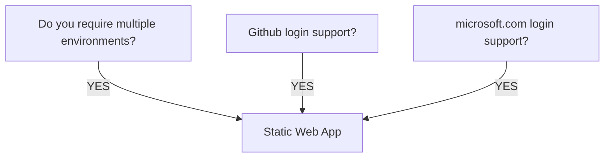

Deciding between an Azure Static Web App vs an attached Static Site to an Azure Storage Account

| Feature                                        | Static Web App | Static Site attached to Storage Account |
|------------------------------------------------|----------------|-----------------------------------------|
| Environments / Slots                           | Y              | N                                       |
| Custom Authentication*                         | Y              |                                         | 
| Supports its own API                           | Y              |                                         |
| Can be accessed via Azure Storage Explorer App |                | Y                                       |
| Deployment via Pipelines                       | Y              | Y                                       |