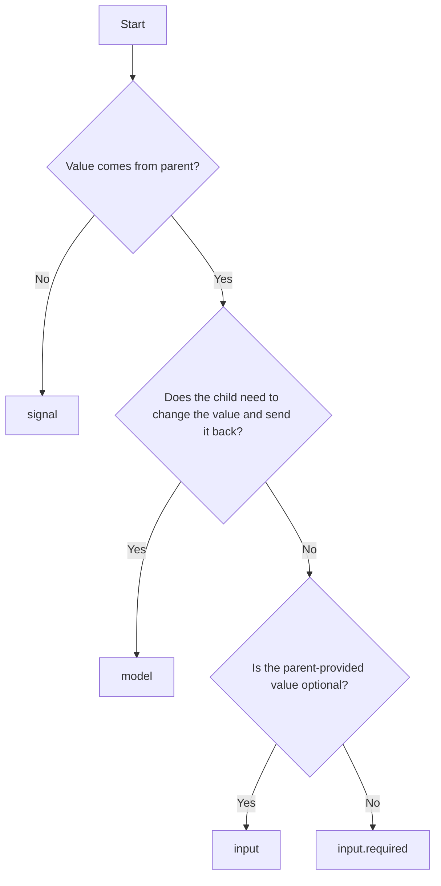

# Angular: signal vs model vs input vs input.required

| API                | Use it when                                              | Best for                                                   | Key behavior                                                         | Avoid when                                                 |
|--------------------|----------------------------------------------------------|------------------------------------------------------------|----------------------------------------------------------------------|------------------------------------------------------------|
| `signal()`         | You need local reactive state inside a component/service | Internal UI state, derived state sources, component logic  | Holds mutable state owned by the current class; updates are explicit | You need parent-to-child binding or shared external inputs |
| `model()`          | You need two-way binding between parent and child        | Form-like components, controlled components, custom inputs | Combines input + output pattern for two-way communication            | The value should be read-only from the child’s perspective |
| `input()`          | You need a normal input from parent to child             | Config props, display data, simple settings                | Read-only input signal, updated by parent                            | The child needs to change the value and sync it back       |
| `input.required()` | You need an input that must be provided by the parent    | Required configuration, critical dependencies              | Same as input(), but Angular enforces presence                       | The input is optional or has a sensible default            |

## Quick rule of thumb
* Use signal() for internal state
* Use input() for optional parent-provided data
* Use input.required() for mandatory parent-provided data
* Use model() for two-way bound values

## Simple examples of intent
* signal(): “This component owns its own count.”
* input(): “Parent tells me what title to show.”
* input.required(): “Parent must provide the user object.”
* model(): “Parent and child both need to stay in sync with the current value.”

## A few practical examples

| Scenario                                   | Recommended API  |
|--------------------------------------------|------------------|
| Toggle state inside a component            | signal()         |
| Display a label passed from parent         | input()          |
| Receive a required product object          | input.required() |
| Build a reusable custom checkbox or slider | model()          |

## Decision tree

