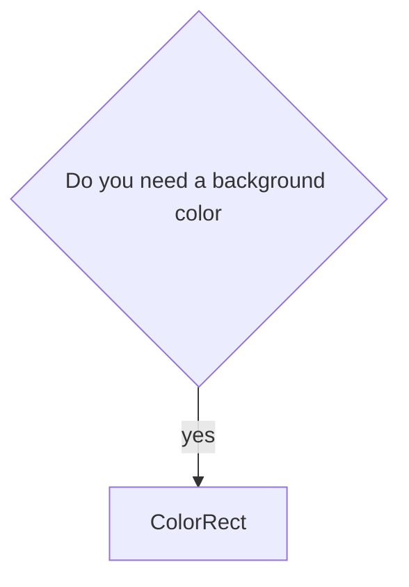

| Node Type                     | 2D Scene   | 3D Scene | User Interface | Node | Control    | CanvasItem |
|-------------------------------|------------|----------|----------------|------|------------|------------|
| Can Move                      | y          |          |                | x    |            |            |
| Detect Mouse Clicks           | y          |          |                | x    | y          |            |
| Can adjust size automatically | y          |          |                | x    | y          |            | 
| Supports Drawing functions    | y          |          |                |      | y          | y          |
| Extends                       | CanvasItem |          |                |      | CanvasItem | y          |
| Supports positioning          | y          |          |                | x    |            | y          |

---

# Which node to use?

