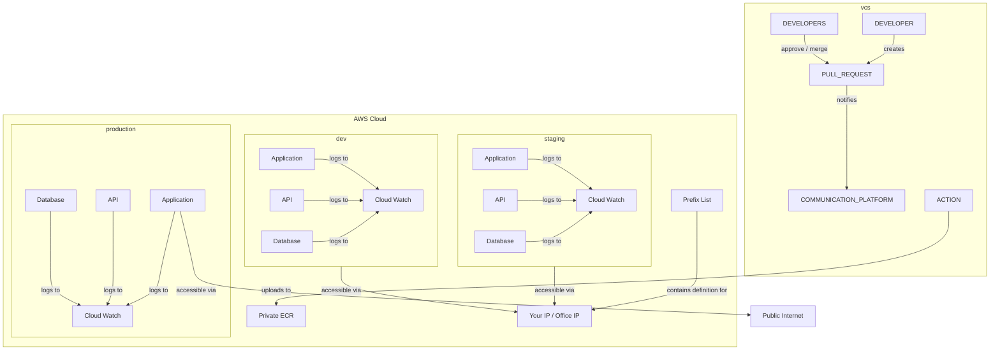

```mermaid
flowchart
    subgraph AWS Cloud
        PRIVATE_ECR["Private ECR"]
        PREFIX_LIST["Prefix List"]
        PREFIX_LIST -- contains definition for --> YOUR_IP
        
        subgraph production
            PROD_APP["Application"]
            PROD_API["API"]
            PROD_DB["Database"]
            PROD_CLOUD_WATCH["Cloud Watch"]
            PROD_APP--logs to -->PROD_CLOUD_WATCH
            PROD_API--logs to -->PROD_CLOUD_WATCH
            PROD_DB--logs to -->PROD_CLOUD_WATCH
        end

        subgraph staging
            STAGING_APP["Application"]
            STAGING_API["API"]
            STAGING_DB["Database"]
            STAGING_CLOUD_WATCH["Cloud Watch"]
            STAGING_APP--logs to -->STAGING_CLOUD_WATCH
            STAGING_API--logs to -->STAGING_CLOUD_WATCH
            STAGING_DB--logs to -->STAGING_CLOUD_WATCH
        end

        subgraph dev
            DEV_APP["Application"]
            DEV_API["API"]
            DEV_DB["Database"]
            DEV_CLOUD_WATCH["Cloud Watch"]
            DEV_APP--logs to -->DEV_CLOUD_WATCH
            DEV_API--logs to -->DEV_CLOUD_WATCH
            DEV_DB--logs to -->DEV_CLOUD_WATCH
        end
    end
    
    subgraph vcs 
        DEVELOPER -- creates --> PULL_REQUEST -- notifies --> COMMUNICATION_PLATFORM
        DEVELOPERS -- approve / merge --> PULL_REQUEST
        ACTION -- uploads to --> PRIVATE_ECR
    end


    YOUR_IP["Your IP / Office IP"]
    staging -- accessible via --> YOUR_IP
    dev -- accessible via --> YOUR_IP
    
    Internet["Public Internet"]
    PROD_APP -- accessible via --> Internet


```