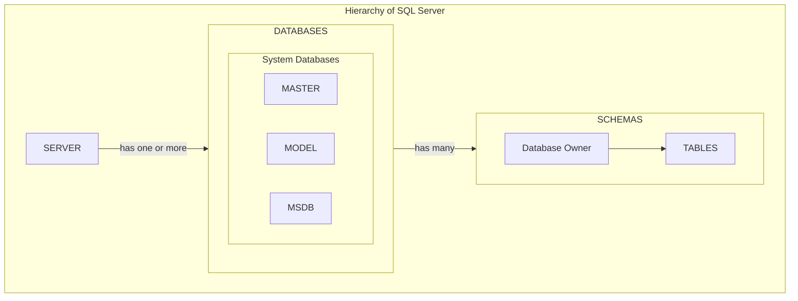

## Using Microsoft Azure
1. You need a Virtual Network
   * Why?
   * So that only apps inside the virtual network can connect to the Database
2. You need a SQL Server
   * Why?
   * https://portal.azure.com/#view/Microsoft_Azure_Marketplace/GalleryItemDetailsBladeNopdl/id/Microsoft.AzureSQL/selectionMode~/false/resourceGroupId//resourceGroupLocation//dontDiscardJourney~/false/selectedMenuId/home/launchingContext~/%7B%22galleryItemId%22%3A%22Microsoft.AzureSQL%22%2C%22source%22%3A%5B%22GalleryFeaturedMenuItemPart%22%2C%22VirtualizedTileDetails%22%5D%2C%22menuItemId%22%3A%22home%22%2C%22subMenuItemId%22%3A%22Search%20results%22%2C%22telemetryId%22%3A%222b366f5f-8036-461a-b1bc-96cc8be929ac%22%7D/searchTelemetryId/1b4e71c9-ae90-4361-8ef6-ca47465b0a1b
3. You need a Network Security Group
   * Why?
4. You need slots

